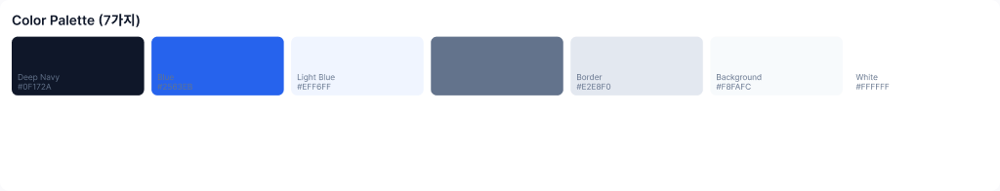
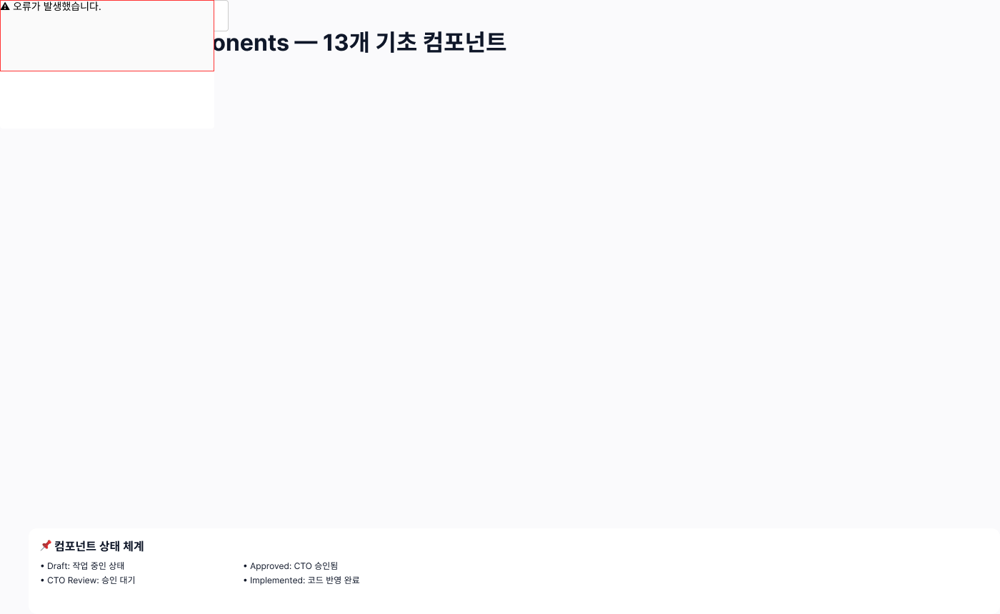
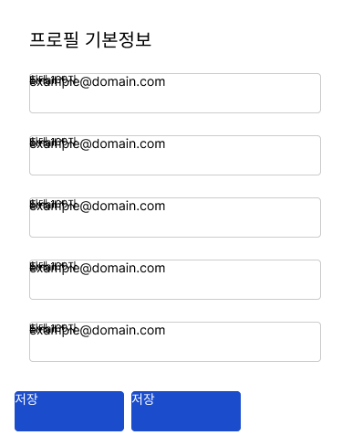
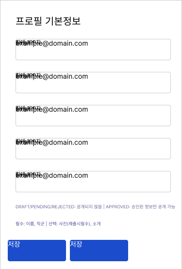
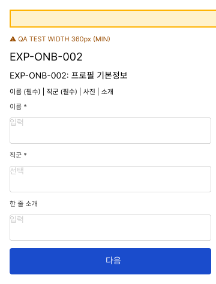

# Figma 디자인 시스템(P0) 현황 점검 보고서

**작성일**: 2026-07-28
**대상**: CTO
**상태**: 조사 완료 (읽기 전용 — Figma/코드/DB/배포 변경 없음)
**대상 파일**: PT Career — Design System P0 (`xbsoci9JEfqjWjHl3X43LV`)
**대조 기준 문서**: `docs/16_P0_DESIGN_OPERATIONS_SETUP.md` (2026-07-20 작성, 11페이지 구조 계획)

---

## 1. 조사 개요

### 1.1 목적

`16_P0_DESIGN_OPERATIONS_SETUP.md`에서 계획한 11페이지 구조·13개 컴포넌트·Screen Status 메타데이터 체계가 Figma 파일에 실제로 얼마나 구축되어 있는지 확인. Figma 파일 자체는 전혀 수정하지 않았음 (읽기 전용 조사).

### 1.2 방법과 한계

- Figma MCP의 페이지 목록 API(`get_metadata`, nodeId 미지정)는 두 개 MCP 인스턴스 모두에서 **`00_Cover` 하나만 반환하는 캐싱 버그**가 재현됨.
- 1차 조사는 이 버그를 우회하기 위해 node-id를 직접 추정(brute-force)하는 방식으로 진행했고, 이 방법으로는 `00_Cover`, `01_Guide`, `02_Foundations`, `03_Components`, `09_Design_QA` 5개 페이지의 콘텐츠 조각만 발견할 수 있었음. 나머지 6개 페이지는 추정 범위 밖에 있어 "확인 못함" 상태였음.
- 2차 조사에서 CTO가 Figma 데스크톱에서 직접 페이지 탭을 열어 `node-id` 8개(`0-1`, `1-2`, `1-3`, `1-4`, `1-5`, `1-6`, `1-7`, `1-10`)를 제공, 이를 통해 **8개 페이지는 정확한 canvas ID로 전체 내용을 확인**함. 나머지 3개(`07_Admin`, `08_Prototype`, `99_Archive`)는 "작업물이 없어 링크를 첨부하지 않았다"는 CTO 확인을 근거로 미착수로 간주함.
- 결과적으로 **11페이지 중 8개는 실제 canvas 단위로 전수 확인**, 3개는 CTO 확인 기반으로 "작업물 없음"으로 처리. 코드/DB/배포 변경은 전혀 수행하지 않았음.

---

## 2. 페이지별 현황

| 페이지 | canvas ID | 확인 방법 | 실제 내용 |
|---|---|---|---|
| 00_Cover | `0:1` | 전수 확인 | 표지 디자인 없음. 0×0 bounding box 캔버스에 03_Components용 컴포넌트 심볼 8개가 잘못 떠 있음(중복본으로 확인) |
| 01_Guide | `1:2` | 전수 확인 | 작업 가이드 텍스트 완비 — 11페이지 구조 안내, 메타데이터 템플릿, Screen Status 5단계 정의, Approved≠Implemented 주의사항. 순수 기획 문서, 화면 아님 |
| 02_Foundations | `1:3` | 전수 확인 | Color System(7색)/Spacing Scale(8단계)/Radius & Layout 3섹션. Typography 섹션 없음. Variable 바인딩 0건(§3) |
| 03_Components | `1:4` | 전수 확인 | 13개 중 11개 심볼 존재하나 레이아웃 없이 좌표(0,0)에 전부 겹쳐 쌓여 있음, 렌더 오류 노출(§4) |
| 04_Expert_Onboarding | `1:5` | 전수 확인 | 5개 화면 × (메인+QA 360px+Prototype Loading/Saved) = 20개 프레임. 메인/프로토타입 프레임 렌더 깨짐(§5) |
| 05_Consumer_Profile | `1:6` | 전수 확인 | 페이지는 생성됨, **자식 노드 0개 — 완전히 빈 캔버스** |
| 06_Expert_Discovery | `1:7` | 전수 확인 | 페이지는 생성됨, **자식 노드 0개 — 완전히 빈 캔버스** |
| 07_Admin | — | CTO 확인 | 작업물 없음 |
| 08_Prototype | — | CTO 확인 | 작업물 없음 (04 페이지 내부에 Prototype Loading/Saved 상태가 흡수되어 있는 것으로 추정) |
| 09_Design_QA | `1:10` | 전수 확인 | 체크리스트 완비 — 공통/모바일/접근성/상태UI/신뢰&법률 5개 카테고리, 총 25개 항목(§6) |
| 99_Archive | — | CTO 확인 | 작업물 없음 |

---

## 3. 02_Foundations — Variable 바인딩 여부

색상·간격·radius가 실제 Figma Variables로 바인딩되어 있는지 `get_variable_defs`로 확인.

- Color System(`6:2`) 대상 조회 → **빈 결과 (`{}`)**
- Spacing Scale(`6:18`) 대상 조회 → **빈 결과 (`{}`)**

**바인딩 안 됨.** 색상은 사각형 도형 + `#0F172A` 같은 hex를 별도 텍스트로 타이핑한 것이고, spacing도 도형 크기 + 숫자 텍스트 라벨일 뿐 — 재사용 가능한 디자인 토큰 구조가 아님. Typography 섹션은 인접 node-id를 모두 뒤져봤지만 존재 자체가 확인되지 않음.

*Color Palette — 7색, hex 코드는 텍스트로 타이핑되어 있을 뿐 Variable 아님*

---

## 4. 03_Components — 13개 중 실존 개수

### 4.1 존재 여부

| 계획된 13개 | 존재 | 비고 |
|---|---|---|
| Primary Button | ❌ | "Button" 심볼 1개만 존재, Primary/Secondary/Text 구분 없음 |
| Secondary Button | ❌ | 위와 동일 |
| Text Button | ❌ | 위와 동일 |
| Input | ✅ | |
| Select | ✅ | |
| Checkbox | ✅ | |
| Radio | ✅ | |
| Badge | ✅ | |
| Specialty Chip | ✅ | |
| Status Message | ✅ | |
| Loading Skeleton | ✅ | |
| Empty State | ✅ | |
| Error State | ✅ | |

**11/13 존재, 나머지는 Button 계열 3종이 사실상 1종("저장" 텍스트가 박힌 고정 인스턴스)으로 뭉뚱그려져 있음.**

### 4.2 Variant/State 커버리지

각 심볼을 열어보면 텍스트 라벨 1개짜리 **단일 고정 인스턴스**뿐 — default/hover/focus/error/disabled 같은 variant/상태 구조는 전혀 없음. Figma component-set이 아니라 낱개 symbol.

### 4.3 레이아웃 문제

11개 심볼이 전부 **좌표 (0, 0)에 겹쳐서 쌓여 있음** — 실제로는 정리된 컴포넌트 진열대가 아니라 원점에 뭉쳐있는 상태. 스크린샷에는 렌더링 오류 박스("⚠️ 오류가 발생했습니다")까지 노출됨.

*페이지 상단에 렌더 오류 박스가 노출되고, 타이틀과 하단 상태 체계 설명 사이는 대부분 빈 공간 — 11개 심볼이 화면에 정상 진열되어 있지 않음*

00_Cover에 떠 있던 8개 심볼(Input, Checkbox, Status Message, Loading Skeleton, Empty State, Error State, Badge, Specialty Chip)은 이 03_Components의 정식 심볼과 이름이 겹치는 **중복본**으로 확인됨.

---

## 5. 04_Expert_Onboarding — 예상보다 많은 작업량, 그러나 렌더링 깨짐

### 5.1 구성

5개 화면(EXP-ONB-002 프로필 기본정보, 003 근무기관, 004 경력 관리, 007 교육 이력, 008 전문분야 선택) × 각 화면당 3종 프레임(메인 / QA 360px 변형 / Prototype Loading·Saved 상태 변형) = **총 20개 프레임.** 화면 번호가 002·003·004·007·008로 건너뛰는 것으로 보아 001·005·006은 별도 계획이 있었으나 착수되지 않은 것으로 추정.

### 5.2 품질 편차 — 같은 화면인데 버전마다 다름

동일 화면(EXP-ONB-002 프로필 기본정보)의 세 버전을 비교:

**메인 프레임(`18:4`) — 깨짐**

*모든 입력창에 "example@domain.com"이라는 엉뚱한 placeholder가 필드 라벨과 겹쳐 표시되고, 하단에 "이전/저장/다음" 3버튼이 아니라 "저장" 버튼 2개가 중복 배치됨*

**Prototype Loading 변형(`95:18`) — 동일하게 깨짐**

*메인 프레임과 동일한 문제(겹친 placeholder, 중복 저장 버튼)가 그대로 재현됨*

**QA 360px 변형(`22:2`) — 정상**

*라벨("이름 *", "직군 *"), 올바른 placeholder("입력", "선택"), 버튼 1개("다음")까지 정상적으로 구현됨*

**원인 추정:** Input 컴포넌트 인스턴스에 필드별 커스터마이징(override)이 적용되지 않은 채 방치되어, 마스터 심볼의 기본 placeholder가 그대로 노출된 것으로 보임. QA 변형만 별도로 다시 작업해 정상인 것으로 추정.

---

## 6. 09_Design_QA — 가장 완성도 높은 페이지

타이틀("Design QA Checklist — 디자인 검증 항목") + 5개 카테고리, 총 25개 체크리스트 항목:

- 🎯 공통 (Common) — 6항목
- 📱 모바일 (Mobile) — 6항목
- ♿ 접근성 (Accessibility) — 5항목
- ⚙️ 상태 UI (State UI) — 5항목
- 🔒 신뢰 & 법률 (Trust & Legal) — 5항목

사용 안내("각 화면을 설계할 때마다 이 체크리스트를 검토")와 최소 기준("공통+모바일+신뢰·법률 필수")까지 포함되어 있어, 11페이지 중 유일하게 실사용 가능한 수준으로 완성됨.

---

## 7. Screen Status 메타데이터 부착 여부

01_Guide에 정의된 메타데이터 필드(Screen Status/Version/Approved Date/Approved By/Related Issue/Working Branch/Implementation Status/Last Design QA/Notes)가 실제 화면에 부착되어 있는지 04_Expert_Onboarding 전체(20개 프레임)를 정규식으로 전수 검사.

**결과: 단 한 건도 부착되어 있지 않음.**

"Draft"/"Approved"라는 단어가 3회 검색되지만, 이는 화면 설계 상태가 아니라 **프로필 공개 정책 문구**("Draft/Pending/Rejected: 공개되지 않음 | Approved: 승인된 정보만 공개 가능")로, 메타데이터 체계와 무관한 우연의 일치임.

03_Components에는 "📌 컴포넌트 상태 체계" 설명 프레임이 있어 Draft/CTO Review/Approved/Implemented 4단계(Deprecated 누락)를 텍스트로 설명하지만, 이는 범례일 뿐 개별 컴포넌트에 실제 태그가 부착된 것은 아님.

---

## 8. Approved / Implemented 화면 여부

확인된 8개 페이지 전체를 통틀어 **Approved 또는 Implemented로 마킹된 화면은 0개.** 따라서 "구현 완료로 승인된 화면과 프로덕션 UI의 일치도" 비교는 대상이 없어 생략함.

---

## 9. 종합 평가

| 페이지 | 상태 요약 |
|---|---|
| 00_Cover | 표지 없음, 중복 컴포넌트만 존재 |
| 01_Guide | 기획 문서로서는 완성도 높음(화면 아님) |
| 02_Foundations | 토큰 정의는 있으나 미바인딩, Typography 누락 |
| 03_Components | 11/13 존재하나 레이아웃 붕괴 + 렌더 오류, variant 0개 |
| 04_Expert_Onboarding | 화면 수는 실제 플로우와 매칭되나 메인/프로토타입 프레임 렌더링 깨짐, QA 변형만 정상 |
| 05_Consumer_Profile | 완전히 빈 페이지 |
| 06_Expert_Discovery | 완전히 빈 페이지 |
| 07_Admin | 미착수 |
| 08_Prototype | 미착수 |
| 09_Design_QA | 유일하게 실사용 가능한 완성도 |
| 99_Archive | 미착수 |

**계획(11페이지, 13컴포넌트, 5단계 Screen Status 체계) 대비 실제 구축 상태는 대략 20~25% 수준.** "완성"된 것은 09_Design_QA 체크리스트 정도이며, 나머지는 부분 착수 상태이거나 착수했지만 렌더링이 깨진 채 방치되어 있음. Screen Status 메타데이터 체계는 문서로만 정의되어 있고 실제 화면에는 한 번도 적용되지 않았음.

---

## 10. 조사 범위 확인

이번 조사에서는 `get_metadata` / `get_variable_defs` / `get_screenshot` (모두 읽기 전용)만 사용했으며, Figma 파일에 대한 쓰기·컴포넌트 생성·페이지 추가/삭제, 코드/DB/배포 변경은 전혀 수행하지 않았습니다.
